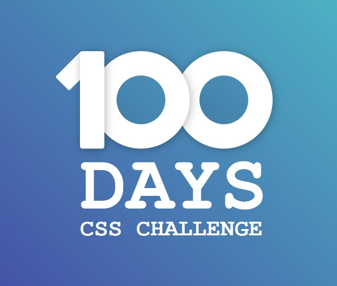

This repository was created to practice and continue learning frontend technologies I enjoy working with.

🛠️ Technologies Used
- HTML
- CSS
- JavaScript
- React

📌 Purpose
Personal learning and portfolio showcase.
Feel free to explore!

I’m currently working on the following practice exercises. 
Below, I’ll be keeping track of my progress. Thanks for stopping by.
Cheers!

100 days of Css Challenge: 
https://100dayscss.com/

Click any of the images below to view the readme and live demo of the project.

  
  

Reto 2:  https://ns-1908.github.io/Practice-proyects/100DaysOfCssChallenge/reto02-menu-hamburguesa/

